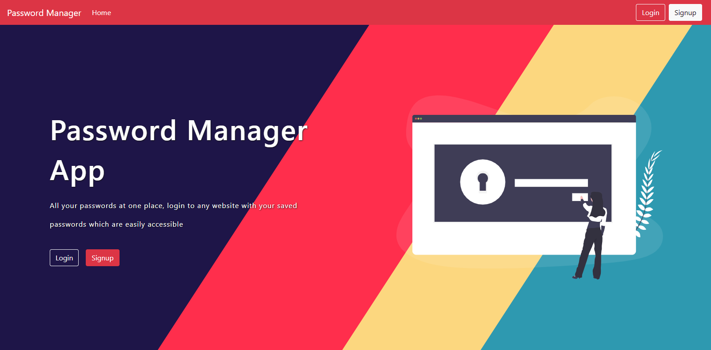
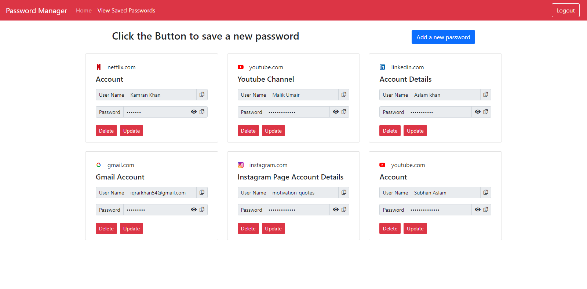

<!-- PROJECT LOGO -->
<br />
<p align="center">

  <h3 align="center">Password Manager</h3>

  <p align="center">
    A web application used to save the important passwords of the user, built with React, Nodejs, MongoDB, Express, JSX, and CSS.
    <br />
  </p>
</p>

<!-- TABLE OF CONTENTS -->
<details open="open">
  <summary>Table of Contents</summary>
  <ol>
    <li>
      <a href="#about-the-project">About The Project</a>
      <ul>
        <li><a href="#built-with">Built With</a></li>
      </ul>
    </li>
    <li>
      <a href="#getting-started">Getting Started</a>
      <ul>
        <li><a href="#installation">Installation</a></li>
      </ul>
    </li>
    <li><a href="#overview">Overview</a></li>
    <li><a href="#contact">Contact</a></li>
  </ol>
</details>

<!-- ABOUT THE PROJECT -->

## About The Project



The Password Manager is a Web Application built using Reactjs, Express, Nodejs, MongoDB. It stores the user's important passwords. The user needs to create an account or log in to save the passwords. When the user login or signup, a json web token is given which has to be sent with the request to verify that it is the same user who created the password and only the user who saved a password, can view it, update it or delete it.

When the user signup, the password is hashed using bcryptjs and stored in the backend. When the user login, the entered password is compared with the hashed password, and if it matches then the user is logged in.

The saved passwords are encrypted using cryptojs and stored in the backend to provide a layer of security. When the authenticated user wants to read their saved passwords, then they are decrypted and sent to the user.

In the frontend, the routes are also protected, a user can only visit the passwords page if it is logged in. When a user logs in, a json web token is sent by the backend which is stored in the local storage to automatically log in the user. However, the token expires in 1 hour on the front end as well as the backend. React context hook is used to manage the app-wide state

In the saved passwords page, the user can add a new password and a request is sent to the backend to store the password to the backend. The user can also update and delete the saved passwords. A copy-to-clipboard feature is also added so that user can easily copy their credentials and log in to the desired website.

A login button is given when the user is logged in to log out. When the logout button is pressed the token is removed from the storage and the users have to login again to access their account.

### Built With

This projects was built using React js, react router, custom css.

- [React](https://reactjs.org/)
- [React Router](https://reactrouter.com/)
- [Express](https://expressjs.com/)
- [Nodejs](https://nodejs.org/en/)
- [MongoDB](https://www.mongodb.com/)
- [Mongoose](https://mongoosejs.com/)
- [Bootstrap](https://getbootstrap.com/)

<!-- GETTING STARTED -->

## Getting Started

To get a local copy up and running follow these simple example steps.

### Installation

1. Clone the repo
   ```sh
   git clone https://github.com/sheharyarIshfaq/password-manager.git
   ```
1. Install NPM packages
   ```sh
   npm install
   ```
1. Navigate into Backend folder
   ```sh
   cd backend
   ```
1. Set the environment variables
   ```sh
   create .env file and store environment variables in it
   ```
1. To Start Backend Server configured with environment variables
   ```sh
   npm run dev
   ```
1. Navigate into Frontend folder
   ```sh
   cd frontend
   ```
1. Set the environment variables
   ```sh
   create .env file and store environment variables in it
   ```
1. To Start Frontend server
   ```sh
   npm start
   ```

## Overview

Images of the project

### Main Page


---

### Saved Passwords Page



---

<!-- CONTACT -->

## Links

Sheharyar Ishfaq - [Facebook](https://web.facebook.com/sheharyarishfaq1) - [Linkedin](https://www.linkedin.com/in/sheharyar-ishfaq/)

Project Link : [Password-Manager](https://github.com/sheharyarIshfaq/password-manager.git)

Live Preview : [Password-Manager](https://password-manager-80661.web.app/)

Backend Link : [Backend Api Link](https://mern-password-manager.herokuapp.com/)
